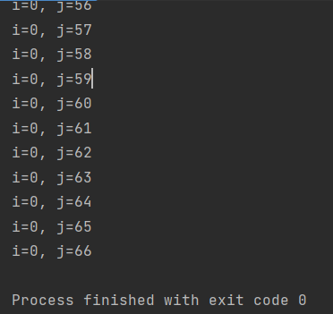
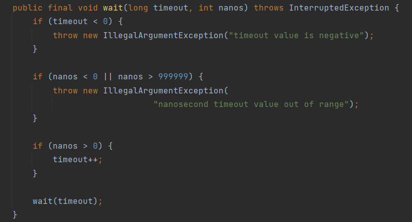

# 基础 118

### 1、面向对象编程有哪些特征？

##### 1、抽象

抽象就是对同一个目标的共有的属性（特征）和方法（功能/行为）进行抽取、归纳、总结。所以抽象不是了解和解决全部问题，而是选择公共的部分，忽略一个主题中与当前目标无关的那些方面。

##### 2、封装（Encapsulation）

封装就是指隐藏对象的属性和实现细节，控制成员属性的访问和修改权限，通过特定公开的方法暴露给外面访问。

比如以下代码：

```java
private String name = "Java面试题";

public String getName() {
    return name;
}
```

name属性被private封装起来，外面只能通过对象的getName才能访问。

##### 3、继承（Inheritance）

继承就是指子类继承父类的成员和方法，使得子类也能具有父类相同的行为。

> Java类之间只能实现单继承，接口之间可以多继承。

##### 4、多态（Polymorphism）

多态是指同一个行为具有多个不同的表现形式或形态，如一个类的方法在不同的情况下有不同表现形式。

> 比如方法重写（Method Overriding）：子类可以重写（覆盖）父类的方法，通过父类引用变量调用该方法时，根据实际对象的类型，会调用子类中的方法。

### 2、JDK与JRE的区别是什么？

#### JDK

JDK全称：Java Development Kit，是整个Java的核心，包含了Java运行环境（JRE）和一系列Java开发工具完整的包。

#### JRE

JRE全称：Java Runtime Environment，是Java程序的运行环境，包含JVM、Java核心类库等。

JRE只能用来运行Java应用程序，不能用于编译开发，它是JDK的子集。


安装完JDK后，就会有JRE目录，JRE属于JDK的子集。

### 3、如何编译和运行Java文件？

1、使用javac命令来编译.java文件

> javac Test.java

运行之后会生成Test.class文件

2、使用java命令来运行

> java Test

### 4、Java中的关键字有哪些？

Java中的关键字：


| 关键字       | 含义                           |
| ------------ | ------------------------------ |
| package      | 指定包名                       |
| import       | 引用类                         |
| class        | 定义类                         |
| interface    | 定义接口                       |
| abstract     | 抽象类或者抽象方法             |
| new          | 创建对象                       |
| this         | 实例本身                       |
| super        | 引用父类                       |
| void         | 无返回                         |
| byte         | 字节型                         |
| char         | 字符型                         |
| int          | 整型                           |
| short        | 短整型                         |
| long         | 长整型                         |
| float        | 单精度浮点型                   |
| double       | 双精度浮点型                   |
| boolean      | 布尔型                         |
| enum         | 枚举型                         |
| strictfp     | 精确浮点                       |
| extends      | 继承类                         |
| implements   | 实现接口                       |
| private      | 私有权限，本类中可用           |
| protected    | 保护权限，本包、本类和子类可用 |
| public       | 公开权限，可挎包用             |
| final        | 类不可继承，方法不可重写、常量 |
| static       | 静态属性                       |
| synchronized | 线程同步                       |
| if           | 如果                           |
| else         | 或者                           |
| for          | for循环                        |
| do           | do while循环                   |
| while        | do while循环                   |
| switch       | switch case分支                |
| case         | switch case分支                |
| default      | switch case分支                |
| break        | 结束循环                       |
| continue     | 继续循环                       |
| return       | 返回                           |
| try          | 异常代码捕获                   |
| catch        | 异常处理                       |
| finally      | 最后处理                       |
| throw        | 手动抛出一个异常               |
| throws       | 声明要抛出的异常               |
| instanceof   | 判断是否xx类的实例             |
| volatile     | 线程可见                       |
| transient    | 不用序列化                     |
| native       | 非Java实现方法                 |
| assert       | 断言                           |
| var          | 任意类型，JDK10增加            |

| 保留关键字 |      |
| ---------- | ---- |
| goto       | 跳转 |
| const      | 常量 |

| 特殊关键字 |      |
| ---------- | ---- |
| true       | 真   |
| false      | 假   |
| null       | 空值 |

### 5、Java标识符命名规则是怎样的？

（1）标识符只能由字母（a-z, A-Z）、数字（0-9）、下划线（_）和美元符号（$）组成；

（2）标识符不能以数字开头；

（3）标识符不能使用Java关键字；

（4）标识符区分大小写；

### 6、Java类命名规范是怎样的？

类名首字母大写，后面每个单词首字母大写，符合**UpperCamelCase**大驼峰式风格，如：

- Order
- OrderDetail
- OrderMonthSummary

但一般像这种总所周知的缩写例外：DO、BO、DTO、VO、AO、PO、UID等。

### 7、Java方法命名规范是怎样的？

方法名首字母小写，后面每个单词首字母大写，符合小驼峰式，如：

- println
- indexOf
- saveOrderInfo

### 8、Java变量命名规范是怎样的？

变量包括方法参数名、成员变量、局部变量。

变量首字母小写，后面每个单词首字母大写，符合LowerCamelCase小驼峰式风格，如：

- amount
- orderPrice
- orderStockInfo

### 9、Java常量命名规范是怎样的？

常量名全部大写，单词间用下划线（_）隔开，如：

- MAX_LIMIT
- MAX_LOOP_COUNT
- ALIPAY_PAY_URL

### 10、Java常量和变量的区别？

##### Java常量和变量的主要区别在于：

常量是一个固定的值，赋值后是不能被改变的；

变量是一个不固定的值，赋值后是可以随时被改变的；

### 11、Java怎么定义一个常量？

Java使用`final`关键字来定义一个常量，如：

```java
final int MAX_COUNT = 100;
```

也可以加修饰范围，以及静态关键字，如：

```java
private static final int MAX_COUNT = 100;
```

### 12、Java常量有几种类型？

##### Java常量有三种类型：

1、静态常量（类中）

2、成员常量（类中）

3、局部常量（类方法中）

### 13、Java有哪几种基本数据类型？

##### Java有4类8中数据类型，它们分别是：

###### 1、整型

byte、short、int、long

###### 2、浮点型

float、double

###### 3、字符型

char

###### 4、布尔型

boolean

### 14、什么是枚举类型？

Java中的枚举是一种特殊的数据类型，用于定义一组常量，枚举使用`enum`进行定义，并且可以包含零个或多个枚举常量，多个用逗号分开。

枚举常量实际上是枚举类的静态实例，编译器会为每个枚举常量生成一个私有构造函数，用于创建枚举常量的实例。枚举常量在内存中只有一个实例，确保唯一性。

> 枚举类型可以用来表示一组固定的值，例如星期几、月份、颜色等，它提供了有一种更简洁、可读性更高的方式来表示一组相关的常量。

以下是一个使用枚举的示例，表示一周的星期几：

```java
enum Day {
    MONDAY,
    TUESDAY,
    WEDNESDAY,
    THURSDAY,
    FRIDAY,
    SATURDAY,
    SUNDAY
}
```

上面`Day`就是一个枚举类，它定义了七个枚举常量，分别代表一周的每一天。

每个常量还可以添加多个字段，比如我添加一个中文名称字段：

```java
public class Test {
    
    public static void main(String[] args) {
        Day today = Day.MONDAY;
        System.out.println("Today is " + today);
        System.out.println("Today is " + today.getChineseName());
    }
    
    enum Day {
        MONDAY("星期一"),
        TUESDAY("星期二"),
        WEDNESDAY("星期三"),
        THURSDAY("星期四"),
        FRIDAY("星期五"),
        SATURDAY("星期六"),
        SUNDAY("星期日");
        
        private String chineseName;
        
        Day(String chineseName) {
            this.chineseName = chineseName;
        }
        
        public String getChineseName() {
            return chineseName;
        }
    }
}
```

输出结果：

```
Today is MONDAY
Today is 星期一
```

### 15、枚举和类的区别？

Java中枚举和类之间的区别：

|          | 枚举                     | 类                                 |
| -------- | ------------------------ | ---------------------------------- |
| 定义方式 | 使用`enum`关键字进行声明 | 使用`class`关键字进行声明          |
| 继承关系 | 不能继承                 | 可以继承其他类                     |
| 实例化   | 枚举常量是枚举类型的实例 | 可以创建类的实例对象               |
| 可修改性 | 枚举常量是不可修改的     | 类的属性和状态可以被修改           |
| 字段     | 可以有自己的字段         | 可以有自己的字段                   |
| 方法     | 可以有自己的方法         | 可以有自己的方法                   |
| 唯一性   | 每个枚举常量是唯一的     | 可以创建多个类的实例对象           |
| 比较     | 使用“==”进行比较         | 可以通过重写`equals()`方法进行比较 |
| 用途     | 表示一组相关的常量       | 封装数据和行为，实现复杂的功能     |

### 16、枚举可以修改吗？

枚举中的常量是不可以修改的，一旦枚举常量被定义，它们的值就是固定的，不能在运行时进行修改，枚举常量是在编译时就确定了的。

比如下面的枚举类型：

```java
enum Day {
        MONDAY("星期一"),
        TUESDAY("星期二"),
        WEDNESDAY("星期三"),
        THURSDAY("星期四"),
        FRIDAY("星期五"),
        SATURDAY("星期六"),
        SUNDAY("星期日");
        
        private String chineseName;
        
        Day(String chineseName) {
            this.chineseName = chineseName;
        }
        
        public String getChineseName() {
            return chineseName;
        }
    }
```

在程序运行期间，这些枚举常量不能删除，也不能添加新的枚举常量，它们的值也不能修改。

但是，枚举常量的字段的值是可以修改的，比如上面的枚举中的chineseName字段，添加一个set方法：

```java
public void setChineseName(String chineseName) {
    this.chineseName = chineseName;
}
```

测试一下：

```java
public static void main(String[] args) {
    Day today = Day.MONDAY;
    Day.MONDAY.setChineseName("礼拜一");
    System.out.println("Today is " + today);
    System.out.println("Today is " + today.getChineseName());
}
```

输出结果：

```
Today is MONDAY
TOday is 礼拜一
```

但是在开发中不建议这样做，一般建议把字段定义为`final`类型，这样就不能修改了。

### 17、枚举命名规范是怎样的？

枚举就是特殊的常量类，命名和类一样。

##### 阿里开发手册推荐：

- 枚举以*Enum命名；
- 枚举字段名称全大写，单词之间使用下划线分隔；

命名示例：

> 状态枚举：StatusEnum
>
> 枚举字段：SUCCESS / FAILED / PROCESS...

### 18、==和equals比较有什么区别？

==

（1）如果比较的对象是基本数据类型，则比较的是数值是否相同；

（2）如果比较的对象是引用数据类型，则比较的是对象的地址是否相同。

equals

equals是Object类提供的方法，接收Object参数类型，如源码所示：

```java
public boolean equals(Object obj) {
    return (this == obj);
}
```

即用来比较两个对象是否相等，默认比较的是对象的地址，不能用于比较基本数据类型，但可以是包装类型，所以，如果要比较两个对象的值是否相等，一般需要重写equals和hashCode方法。

比如常用的String、Date、Integer等类都重写了equals和hashCode方法，使其比较的是存储对象的内容是否相等，而不是堆内存地址。

19、字符串比较使用equals还是==？为什么？

如String类源码所示，它已经重写了equals方法：


String中的equals方法是先用==比较是否同一个对象，然后再比较内容是否相同。

所以如果要比较字符串对象的内容是否相等就用equals方法，而要比较字符串的内存地址是否相等就用==比较，不过实际情况都是比较字符串内容而不会是比较内存地址。

如下面的示例：

```java
public static void main(String[] args) {
    String str1 = new String("java面试题");
    String str2 = new String("java面试题");
    
    // 两个不同字符串对象==比较，返回false
    System.out.println(str1 == str2);
    
    // 两个字符串内容相同equals比较，返回true
    System.out.println(str1.equals(str2));
}
```

输出结果：

```
false
true
```

### 20、Java支持xx≠null不等于写法吗？

不支持，正常的不等于写法是：`!=`

### 21、public、private、protected、默认的区别？

具体区别如下表所示：

| 作用域       | 当前类 | 当前包 | 子孙类 | 其他包 |
| ------------ | ------ | ------ | ------ | ------ |
| public       | √      | √      | √      | √      |
| protected    | √      | √      | √      |        |
| 默认（不写） | √      | √      |        |        |
| private      | √      |        |        |        |

不写为默认作用域，比如以下用来修饰成员变量：

```java 
public class User {
    String name;
}
```

这个默认没有关键字，不用写。

### 22、this和super有什么区别？

##### this：代表当前对象本身：

- this(...)：调用本类的构造方法；
- this.成员变量：调用当前对象的成员变量，包括从父类继承的；
- this.成员方法(...)：调用当前对象的成员方法，包括从父类继承的；

##### super：代表当前对象的父类：

- super(...)：调用父类的构造方法；
- super.成员变量：调用父类的成员变量；
- super.成员方法(...)：调用父类的成员方法；

### 23、Java中的运算符都有那些？

Java中运算符有以下几类：

| 运算符     | 示例                                                     |
| ---------- | -------------------------------------------------------- |
| 算术运算符 | +   -   *   /   %   ++   -                               |
| 关系运算符 | ==   !=   >   <   >=   <=                                |
| 位运算符   | &   ^   ~ >>   <<   >>>                                  |
| 逻辑运算符 | &&   \|\|   !                                            |
| 赋值运算符 | =   +=   -=   *=   /=   (%)=   <<=   >>=   &=   ^=   \|= |
| 三目运算符 | ? :                                                      |

优先级从高到低排列：

| 类别     | 操作符                                                 | 关联性   |
| -------- | ------------------------------------------------------ | -------- |
| 后缀     | ()   []   .                                            | 左到右   |
| 一元     | i++   i-                                               | 从左到右 |
| 一元     | ++i   --i   +   -   ~   !                              | 从右到左 |
| 乘性     | *   /   %                                              | 左到右   |
| 加性     | +   -                                                  | 左到右   |
| 移位     | >>   >>>   <<                                          | 左到右   |
| 关系     | >   >=   <   <=                                        | 左到右   |
| 相等     | ==   !=                                                | 左到右   |
| 按位与   | &                                                      | 左到右   |
| 按位异或 | ^                                                      | 左到右   |
| 按位或   | \|                                                     | 左到右   |
| 逻辑与   | &&                                                     | 左到右   |
| 逻辑或   | \|\|                                                   | 左到右   |
| 条件     | ? :                                                    | 从右到左 |
| 赋值     | =   +=   -=   *=   /=   %=   >>=   <<=   &=   ^=   \|= | 从右到左 |
| 逗号     | ,                                                      | 左到右   |

### 24、`s1 = s1 + 1`和`s1 += 1`的区别？

如果s1原有数据类型小于int类型，则s1 = s1 + 1会发生编译异常，如下面的程序所示：


因为s1为short类型，而数字1默认为int类型，所以计算的结果则为int类型，它不能自动转换为比它更小的类型，所以会发生编译异常。

解决办法就是使用类型强制转换：

```java
public static void main(String[] args) throws Exception {
    short s1 = 1;
    s1 = (short) (s1 + 1);
    System.out.println(s1);    // s1 = 2
}
```

使用s1 += 1则不会有任何问题，因为s1 += 1支持`隐式强制类型转换`，涉及到表达式类型自动提升，会自动提升为计算结果的数据类型，如以下程序：

```java
public static void main(String[] args) throws Exception {
    short s1 = 1;
    s1 += 1;
    System.out.println(s1);   // s1 = 2
}
```

### 25、`short s1 = 1; s1 += 1;`有错吗？

没错，可以正常编译，如下图所示：


因为s1 += 1;相当于s1 = (short) (s1 + 1)，其中有隐式强制类型转换。

### 26、`short s1 = 1; s1 = s1 + 1;`有错吗？

有错，如下图所示：


因为1是int类型，因此s1 + 1运算结果也是int类型，需要强制转换类型才能赋值给short型。


### 27、`float n = 1.8`有错吗？

答案：**有错！！！**

数字1.8默认是双精度数（double），将双精度型（double）赋值给单精度型浮点型（float）属于向下转型（down-casting），会产生编译错误：


因此，需要强制类型转换：

> float n = (float) 1.8;

或者写成这种形式：

> float f = 1.8F;

F即表示float类型。

### 28、`i++`和`++i`的区别？

`i++`是先取值后再自增，`++i`是先自增后再取值，来看下面这段程序就明白了：

```java
public static void main(String[] args) {
    int i = 1;
    int j = i++ + 1;
    System.out.println(j);   // j = 2
    
    i = 1;
    int k = ++i + 1;
    System.out.println(k);    // k =3
}
```

程序解读：

- i++先取值再自增，所以 j = 1 + 1 = 2
- ++i先自增再取值，所以 k = 2 +1 = 3

### 29、`while`和`do while`有啥区别？

`while`和`do while`都是循环语句，不同的是，`while`是先判断条件在执行循环，而`do while`是先执行循环再判断条件：

```java
public static void main(String[] args) {
    int i = 0;
    while (i < 5) {
        System.out.println("i = " + ++i);
    }
    
    i = 0;
    do {
        System.out.println("i = " + ++i);
    } while (i < 5);
}
```

所以说，在同样条件下，如果初始条件不成立，do while是会多执行一次的。

### 30、如何跳出Java中的循环？

###### 可以使用以下关键字：

| 关键字   | 说明                   |
| -------- | ---------------------- |
| continue | 跳出当前本次循环       |
| break    | 跳出整个循环           |
| return   | 跳出整个循环及当前方法 |

### 31、如何跳出Java中的多层嵌套循环？

可以在最外面的循环语句前定义一个标号，然后在最里层循环体中使用break标号语句跳出嵌套循环。

如以下程序所示：

```java
public static void main(String[] args) {
    breakPrint:
    for (int i = 0; i < 100; i++) {
        for (int j = 0; j < 100; j++) {
            System.out.println("i=" + i + ", j=" + j);
            if (j == 66) {
                break breakPrint;
            }
        }
    }
}
```

输出结果如下：



可以看到，i之输出到0，证明多层循环被全部跳出了。

### 32、`&`和`&&`的区别？

> 逻辑判断推荐使用&&，位运算则需要使用&

&和&&都可以用作逻辑与的运算符，表示逻辑与（and），当运算符两边的表达式的结果都为true时，整个运算结果才为true，否则，只要有一方为false，则结果为false。

&&还具有短路的功能，即如果第一个表达式为false，则不再计算第二个表达式。

&还可以用作位运算符，当&操作符两边的表达式不是boolean类型时，&表示按位与操作，我们通常使用0x0f来与一个整数进行&运算，来获取该整数的最低4个bit位，例如，0x31 & 0x0f 的结果为0x01。

### 33、Java怎么进行数组初始化？

方法一：

```java
// 一维数组
int[] arr = new int[5];

// 二维数组
int[][] arr = new int[3][4];
```

方法二：

```java
// 一维数组
int[] arr = {1, 2, 3, 4, 5};
```

### 34、数组有没有length方法？Sring呢？

数组没有length()方法，但是有length属性，String有length()方法。

使用实例如下：

```java
public static void main(String[] args) {
    String str = "Java";
    String[] languages = new String[]{"java", "PHP", "GO"};
    System.out.println(str.length());
    System.out.println(languages.length);
}
```

结果输出：


### 35、怎么理解值传递和引用传递？

**值传递**：传递的是基本类型参数的字面量值的拷贝，方法对参数的修改不会影响之前参数的值。

**引用传递**：传递的是该参量所引用的对象在堆中地址值的拷贝，而不是拷贝整个对象本身，方法对参数的修改会直接影响参数之前的值。

### 36、Java到底是值传递还是引用传递？

网上很多争议，这里解读下：

> 严格来说，Java只有值传递，看传递的对象是基本数据类型，还是引用类型，理解这一点，怎么个说法并不重要。

### 37、Java中的注释有哪些写法？

1、单行注释

```java
private int id;   // 这是ID
```

2、块注释

```java
private int id;  /* 这是ID */
```

3、文档注释

```java
/**
* 这是ID
*/
private int id;
```

### 38、Java中的构造方法是什么？

构造方法是构造类的主要方法，Java中的每个类都必须要有构造方法，构造方法名和类名相同，没有返回类型， new一个对象的时候就会调用指定的构造方法，如图：

```java
public class Test {
    private int id;
    
    public Test() {
        this.id = 100;
    }
}
```

如果只有一个默认的构造方法，不需要赋值初始化，则可以省略，比如：

```java
public class Test {
    private int id;
    
    public int getId() {
        return id;
    }
    
    public void setId(int id) {
        this.id = id;
    }
}
```

### 39、Java一个类可以有多少个构造方法？

一个类**至少有一个**构造方法，也可以**有多个**构造方法，即构造方法重载，方法参数数量或者类型不同，如代码所示：

```java
public class Test {
    private int id;
    
    public Test() {
        this.id = 100;
    }
    
    public Test(int id) {
        this.id = id;
    }
}
```

如果没有显式地创建构造方法，Java编译器也会为该类提供一个默认构造方法。

### 40、`static`关键字有什么用？

static代表“**静态**”地意思，可以用来修饰：

- 静态内部类（静态内部类可以不依赖外部类实例对象而被实例化，而内部类需要在外部类实例化后才能被实例化）
- 静态方法（静态方法属于类方法，不需要实例化对象就能调用）
- 静态变量（静态变量属于类，不需要实例化对象就能调用）
- 静态代码块（静态代码块只会在类被加载时执行且执行一次）

使用实例如下：

```java
public class Test {
    static {
        System.out.println("静态代码块");
    }
    
    static class Test2 {
        
    }
    
    private static int id = 0;
    
    public static void staticMethod() {
        
    }
}
```

### 41、`static`变量和普通变量地区别？

##### 1、所属目标不同

静态变量属于类的变量，普通变量属于对象的变量。

##### 2、存储区域不同

静态变量存储在方法区地静态区，普通变量存储在堆区。

> 另外：JDK7及以上，静态变量存储在其对应的Class对象中，而Class对象和其他普通对象一样，都存储在堆中的。

##### 3、加载时间不同

静态变量是随着类的加载而加载，随着类的消失而消失；

普通变量随着对象的加载而加载，随着对象的消失而消失。

##### 4、调用方式不同

静态变量只能通过类名、对象调用，普通变量只能通过对象调用。

### 42、`static`可以修饰局部变量吗？

static不能修饰局部变量，可以是内部类、全局成员变量、方法、代码块。

### 43、在`static`方法中可不可使用`this`或`super`，为什么？

在`static`方法中不可以使用`this`和`super`关键字：


因为this和super代表的是实例化后的操作对象，而static属于类级别，无法指向任何实例。

### 44、final关键字有哪些用法？

final关键字的用法如下表：

| 修饰类型 | 说明                                 |
| -------- | ------------------------------------ |
| 修饰类   | 表示该类不能被继承                   |
| 修饰方法 | 表示该方法不能被重写                 |
| 修饰变量 | 表示常量，只能复赋值一次，不能被修改 |

### 45、final、finally、finalize有什么区别？

#### final

final是修饰符：

- 如果修饰类，此类就不能被继承；
- 如果修饰方法，此方法就不能被重写；
- 如果修饰变量，此变量就不能再被改变；

#### finally

finally是try-catch-finally最后的一部分，表示不论发生任何情况都会执行的部分，finally部分可以省略，但如果finally部分存在，则一定会执行finally里面的代码（发生Error错误等非程序性异常除外）。

#### finalize

finalize是Object类的一个方法，在垃圾收集器执行的时候会自动调用被回收对象的此方法，一般不建议主动使用。

### 46、Java支持多继承吗？

Java类与类之间不支持多继承，只能单继承：


Java接口与接口之间支持多继承：


### 47、Java类可以实现多个接口吗？

可以的，一个类可以实现多个接口：


### 48、重载和重写有什么区别？

##### 方法重写

是父类与子类之间多态性的一种表现，即子类可以覆盖从父类继承的方法，重写的方法一般使用@Override标识，比如以下实例：

```java
@Override
public String toString() {
    return this.getName() + ...
}
```

这里是重写了Object祖先类的toString方法。

##### 方法重载

是一个类中方法多态性的一种表现，即一个类中可以有多个同名的方法，方法的参数类型不同，或者参数个数不同，返回类型可以相同也可以不同，比如以下实例：

```java
public Connection connection(String host) {
    ...
}

public Connection connection(String host, int port) {
    ...
}
```

同一个方法名，可以有多个不同的连接参数创建连接，这是很常见的方法重载方式。

### 49、构造器可以被重写和重载吗？

一个类的构造器只属于当前类，它不能被继承，所以它不能被重写。

一个类里面可以有多个构造器，所以它可以被重载。

### 50、私有方法能被重载或者重写吗？

##### 使用private修饰的私有方法，只可以重载，不能被子类重写。

因为private该作用域就只能在当前类中可见，子类见都见不到，别谈重写，重写至少需要protected及以上的作用域。

### 51、静态方法能被重载或者重写吗？

**静态方法可以被重载**，一个类可以存在多个同名但不同参数的static方法。

**静态方法不可以被重写**，如果子类也定义了相同的，会被子类同名的静态变量，静态方法所隐藏。

### 52、静态方法可以被继承吗？

（1）父类的静态属性、静态方法可以被子类继承；

（2）如果子类也定义了相同的静态属性、方法，那父类中的定义就会被子类同名的静态变量，静态方法所隐藏。

### 53、Java异常有哪些分类？

下面是Java异常类的组织结构，红色区域的异常类表示是程序需要显示捕捉或者抛出的。


##### Throwable

Throwable是Java异常的顶级类，所有的异常都继承于这个类。

Error，Exception是异常类的两个大分类。

##### Error

Error是非程序异常，即程序不能捕获的异常，一般是编译或者系统性的错误，如OutOfMemorry内存溢出异常等。

##### Exception

Exception是程序异常类，由程序内部产生，Exception又分为运行时异常、非运行时异常。

##### 运行时异常

运行时异常的特点是Java编译器不会检查它，也就是说，当程序中可能出现这类异常，即使没有用try-catch语句捕获它，也没有用throws子句声明抛出它，也会编译通过，运行时异常可处理或者不处理。

##### 非运行时异常

非运行时异常是程序必须进行处理的异常，捕获或者抛出，如果不处理程序就不能编译通过。如常见的IOException、ClassNotFoundException等。

### 54、`Error`和`Exception`有什么区别？

`Error`和`Exception`都属于异常总父类Throwable的子类：


**Error**表示系统级的错误和程序不必处理的异常，它是一种严重的非程序性的错误，比如内存溢出错误，它不能由程序控制和处理。

**Exception**则表示程序性异常，可以由程序进行定义、控制和处理。

### 55、Java中常见的异常有哪些？

##### 1、NullPointerException

空指针异常，操作一个null对象的方法或属性时会抛出这个异常。

##### 2、OutOfMemoryError

内存异常异常，这不是程序能控制的，是指要分配的对象的内存超出了当前最大的堆内存，需要调整堆内存大小（-Xmx）以及优化程序。

##### 3、IOException

IO，即：input，output，我们在读写磁盘文件、网络内容的时候经常会发生的一种异常，这种异常是受检查异常，需要进行手工捕获。

如文件读写会抛出IOException：

```JAVA
public int read() throws IOException
public void write(int b) throws IOException
```

##### 4、FileNotFoundException

文件找不到异常，如果文件不存在就会抛出这种异常。

如定义输入输出文件流，文件不存在会报错：

```java 
public FileInputStream(File file) throws FileNotFoundException
public FileOutputstream(File file) throws FileNotFoundException
```

FileNotFoundException其实是IOException的子类，同样是受检查异常，需要进行手工捕获。

##### 5、ClassNotFoundException

类找不到异常，Java开发中经常遇到，这是在加载类的时候跑出来的，即在类路径下不能加载指定的类。

看一个示例：

```java
public static <T> Class<T> getExistingClass(ClassLoader classLoader, String className) {
    try {
        return (Class<T>) Class.forName(className, true, classLoader);
    } catch (ClassNotFoundException e) {
        return null;
    }
}
```

它是受检查异常，需要进行手工捕获。

##### 6、ClassCastException

类转换异常，将一个不是该类的实例转换成这个类就会抛出这个异常。

如将一个数字强制转换成字符串就会报这个异常：

```java
Object x = new Integer(0);
System.out.println((String)x);
```

这是运行时异常，不需要手工捕获。

##### 7、NoSuchMethodException

没有这个方法异常，一般发生在反射调用方法的时候，如：

```java 
public Method getMethod(String name, Class<?>...parameterTypes) throws NoSuchMethodException, SecurityException {
    checkMemberAccess(Member.PUBLIC, Reflection.getCallerClass(), true);
    Method method = getMethod0(name, parameterTypes, true);
    if (method == null) {
        throw new NoSuchMethodException(getName() + "." + name + argumentTypesToString(parameterTypes));
    }
    return method;
}
```

它是受检查异常，需要进行手工捕获。

##### 8、IndexOutOfBoundsException

索引越界异常，当操作一个字符串或者数组的时候经常遇到的异常。


如图所示，它是运行时异常，不需要手工捕获。

##### 9、ArithmeticException

算术异常，发生在数字的算术运算时的异常，如一个数字除以0就会报这个错。

```java
double n = 3 / 0;
```

这个异常虽然是运行时异常，可以手工捕获抛出自定义的异常，如：

```java
public static TimeStamp from(Instant instant) {
    try {
        TimeStamp stamp = new TimeStamp(instant.getEpochSecond() * MILLIS_PER_SECOND);
        stamp.nanos = instant.getNano();
        return stamp;
    } catch (ArithmeticException ex) {
        throw new IllegaArgumentException(ex);
    }
}
```

##### 10、SQLException

SQL异常，发生在操作数据库时的异常。

如下面的获取连接：

```java
public Connection getConnection() throws SQLException {
    if (getUser() == null) {
        return DriverManager.getConnection(url);
    } else {
        return DriverManager.getConnection(url, getUser(), getPassword());
    }
}
```

又或者时获取下一条记录的时候：

```java
boolean next() throws SQLException;
```

它是受检查异常，需要进行手工捕获。

### 56、Java中常见的运行时异常有哪些？

常见的运行时异常（RuntimeException）主要有：

| 异常                      | 说明             |
| ------------------------- | ---------------- |
| NullPointerException      | 空指针异常       |
| IndexOutOfBoundsException | 数组越界异常     |
| ClassCastException        | 类型强制转换异常 |
| ArithmeticException       | 算术异常         |
| SecurityException         | 违背安全原则异常 |

更多可以查看RuntimeException运行时异常类的子异常。

### 57、运行时异常与受检查异常有什么区别？

##### 运行时异常

指RuntimeException异常类及其子类，表示在程序运行时才可能发生的异常，编译器编译时不用检查，方法可以不用主动catch，也可以不用throws声明抛出运行时异常。

##### 受检查异常

指非RuntimeException类型的异常，即编译器在编译时就会检查的异常，方法需要主动catch或者用throws声明所用的受检查异常，不然会出现编译错误。

----

空指针异常是运行时异常：


在程序中可以不用声明，也不用捕获。

IO异常是受检查异常：


在程序中必须声明或者捕获。

### 58、什么时候会发生空指针异常？

当一个变量的值为null时，在Java里面表示一个不存在的空对象，没有实际内容，没有给它分配内存，null也是对象成员变量的默认值。

所以，一个对象如果没有进行初始化操作，这时候，如果你调用这个对象的方法或者变量，就会出现空指针异常。如下面示例会发生空指针异常：

```java
Object object = null;
String string = object.toString();
```


从类结构图来看，空指针它是属于运行时异常`RuntimeException`的子类，他不是捕获型的，只有在程序运行时才可能报出来，而且会造成程序中断。

### 59、你知道有哪些避免空指针的方法？

下面说几个空指针的几个最常见的案例及解决之道。

##### 1、字符串比较，常量放前面

```java
if(status.equals(SUCCESS)) {
    
}
```

这个时候status可能为null造成空指针异常，应该把常量放前面，就能避免空指针异常。

```java
if(SUCCESS.equals(status)) {
    
}
```

这个应该在各种开发规范里面都会提到，也是最基础的。

##### 2、初始化默认值

在对象初始化的时候给它一个默认值或者默认构造实现，如：

```java 
User user = new User();
String name = StringUtils.EMPTY;
```

##### 3、返回空集合

在返回一个集合的话，默认会是null，统一规范返回一个空集合。

举个List例子，如：

```java
public List getUserList() {
    List list = userMapper.getUserList();
    return list == null ? new ArrayList() : list;
}
```

这样接收方就不用担心空指针异常了，也不会影响业务。

##### 4、断言

断言是用来检查程序的安全性的，在使用之前进行检查条件，如果不符合条件就报异常，符合就继续。

Java中自带的断言关键字，assert，如：

```java
assert name == null : "名称不能为空";
```

输出：

```java
Exception in thread "main" java.lang.AssertionError: 名称不正确
```

不过默认是不启动断言检查的，需要带上JVM参数：-enableassertions才能生效。

Java中这个用的很少，建议使用Spring中的，更强大，更方便好用。

Spring中的用法：

```java
Assert.notNull(name, "名称不能为空");
```

##### 5、Optional

Optional是JDK 8 新增的新特性，再也不用 `!=null`来判断了，这个在一个对象里面的多个子对象连续判断的时候非常有用。

> 这里大概介绍5种，其实还有更多，如何避免空指针，一是要注意代码编写规范，二是要提高代码素养。

### 60、`throw`和`throws`的区别？

`throw`用在方法中，用来主动抛出一个异常，`throws`则是用在方法声明中，声明方法可能会抛出的异常。

来看Object#wait方法的使用示例：

 

两个不一定要同时使用，如果方法中抛出的是RuntimeException及其子异常，则方法可以不用throws声明，否则需要强制声明，比如下面的示例：


test1方法正常编译，而test2方法抛出的不是RuntimeException类型，又没有使用throws声明抛出，所以会报编译错误：

正确修改后：

```java
public void test1() {
    throw new RuntimeException();
}

public void test2() throws Exception {
    throw new Exception();
}
```

### 61、`try-catch-finally`中哪个部分可以省略？

`try-catch-finally`其中`catch`和`finally`都可以被省略，但是不能同时省略，也就是说有`try`的时候，必须后面跟一个`catch`或者`finally`。

如果是资源处理类型，并且实现了AutoCloseable接口，把定义它放在try(...)中，然后方法上再加上throws异常，是可以省略catch和finally的，只需要try即可，比如：

```java
private void test() throws Exception {
    try (InputStream is = new FileInputStream("")) {
        ...
    }
}
```

### 62、Java可以一次`catch`多个异常吗？

Java 7开始可以一次catch多个异常，比如：

```java
public static void mian(String[] args) throws Exception {
    try {
        System.out.println("java面试题");
    } catch (SecurityException | NullPointerException | NoClassDefFoundError e) {
        
    }
}
```

### 63、使用`try-catch`会影响性能吗？

一般情况下，`try-catch`块的执行时间很短，它不会对性能产生显著的影响，但是在极端情况下，try-catch块的使用可能会对性能产生影响。比如在代码中频繁地抛出和捕获异常，尤其是在高并发的情况下，`try-catch`块的性能可能会成为瓶颈。在这种情况下，可以使用其他方式处理异常，如：条件判断，以提高代码的性能。

来自阿里巴巴《Java开发手册》中的异常规范：

> 异常设计的初衷是解决程序运行中的各种意外情况，且异常的处理效率比条件判断方式要低很多，所以：
>
> （1）可以通过预检查的方式规避异常，而不是依赖try-catch来处理。
>
> （2）异常捕获后不要用来做流程控制，条件控制。

### 64、`int`和`Integer`有什么区别？

##### 最主要的几点区别：

（1）int是一种基本数据类型，Integer则是int的包装类型。

（2）int的默认值是0，而Integer属于Java类，所以它的默认值是null。

（3）int可以直接使用，而Integer属于Java类，所以它需要经过实例化才能使用。

（4）Integer属于Java类，所以它的使用范围更广，比如泛型，int则不行。

### 65、什么是包装类型？有什么用？

#### 什么是包装类型

Java设计当初就提供了8种基本数据类型及对应的8种包装数据类型，我们知道Java是一种面向对象编程的高级语言，所以包装类型正是为了解决基本数据类型无法面向对象编程所提供的。

下面是基本数据类型与对应的包装类型。

| 基本数据类型 | 包装类型  |
| ------------ | --------- |
| byte         | Byte      |
| boolean      | Boolean   |
| short        | Short     |
| char         | Character |
| int          | Integer   |
| long         | Long      |
| float        | Float     |
| double       | Double    |

下面是包装类型的继承结构图。


从以上图表可以对基本类型和包装类型有一个全面的了解。

##### 包装类应用场景

###### 1、集合类泛型只能是包装类；

```java
// 编译报错
List<int> list1 = new ArrayList<>();

// 正常
List<Integer> list2 = new ArrayList<>();
```

###### 2、成员变量不能有默认值；

```java
private int status;
```

基本数据类型的成员变量都有默认值，如以上代码status默认值为0，如果定义中0代表失败，那样就会有问题，这样只能使用包装类Integer，它的默认值为null，所以就不会有默认值影响。

###### 3、方法参数允许定义空值；

```java 
private static void test1(int status) {
    System.out.println(status);
}
```

看以上代码，方法参数定义的是基本数据类型int，所以必须得传一个数字过来，不能传null，很多场合我们希望是能传递null的，所以这种场合包装类比较合适。

### 66、什么是自动装箱、拆箱？

##### 自动装箱、拆箱

Java 5增加了自动装箱、拆箱机制，提供基本数据类型和包装类型的相互转换操作。

##### 自动装箱

自动装箱即自动将基本数据类型转换成包装类型，在Java 5之前，要将基本数据类型转换成安装类型只能这样做，看下面的代码：

```java
public static void main(String[] args) {
    Integer i1 = new Integer(8);   // 此种方式，Java9已标识废除
    Integer i2 = Integer.valueOf(8);
    
    // 自动装箱
    Integer i3 = 8;
}
```

第3种方法也正是自动装箱功能，其实自动装箱的原理就是调用包装类的`valueOf`方法，如第2个方法中的Integer.valueOf()方法。

> 另外，第一种构造器方法也不推荐使用了，已经标为废弃了。

##### 自动拆箱

自动拆箱即自动将包装类型转换成基本数据类型，与自动装箱相反，有装就有拆，很好理解，看下面的例子，

```java
public static void main(String[] args) {
    Integer i1 = new Integer(8);
    Integer i2 = Integer.valueOf(8);
    
    // 自动装箱
    Integer i3 = 8;
    
    // 自动拆箱
    int i4 = i3;
    int i5 = i3.intValue();
}
```

把i3赋值给i4就是实现的自动拆箱功能，自动拆箱的原理就是调用包装类的`xxValue`方法，如i5中的Integer的`intValue`方法。

> 自动装箱、拆箱不只是体现在以上的例子，在方法接收参数、对象设置参数时都能自动装箱拆箱。

### 67、你怎么理解Java中的强制类型转换？

强制类型转换我们再清楚不过了，即强制显示的把一个数据类型转换为另外一种数据类型。

如以下示例：

```java
short s = 199;
int i = s;   // 199

double d = 10.24;
long l1 = (long)d; // 10
```

以上的转换结果都在我们的预期之内，属于正常的转换和丢失精度的情况，下面的例子就一样属于数据溢出的情况：

```java
int ii = 300;
byte b = (byte)ii;
```

300已经超出了byte类型表示的范围，所以会转换成一个毫无意义的数字。

### 68、你怎么理解Java中的自动类型转换？

**自动类型转换**：是指数字表示范围小的数据类型可以自动转换成范围大的数据类型。

如：

```java
long l = 100;

int i = 200;
long ll = i;
```

具体自动转换如下图所示。

 

实线表示自动转换时不会造成数据丢失，虚线则可能出现数据丢失问题。

**自动转换也要小心数据溢出问题，看下面的例子。**

```java
int count = 100000000;
int price = 1999;
long totalPrice = count * price;
```

编译没任何问题，但结果却输出的是负数，这是因为两个相乘得到的结果是int，相乘的结果超出了int的代表范围。这种情况，一般把第一个数据转换成范围大的数据类型在和其他的数据进行运算。

```java
int count = 100000000;
int price = 1999;
long totalPrice = (long)count * price;
```

另外，向下转换时可以直接将int常量字面量赋值给byte、short、char等数据类型，而不需要强制转换，只要该常量值不超过该类型的表示范围都能自动转换。

### 69、你怎么理解Java中的类型提升？

##### 类型提升

所谓类型提升就是指在多种不同数据类型的表达式中，类型会自动向范围表示大的值的数据类型提升。

如下面的示例：

```java
long count = 100000000;
int price = 1999;
long totalPrice = price * count;
```

price为int型，count为long型，运算结果自动向上提升为long型，运算结果正常，没有出现溢出的情况。

### 70、怎么理解Java中的多态机制？

多态，即”**多种状态**“的意思，在Java中有以下几种情形。

##### 一、方法多态

- 方法重写：是父类与子类之间多态性的一种表现，即子类可以覆盖从父类继承的方法；
- 方法重载：是一个类中方法多态性的一种表现，即一个类中可以有多个同名的方法，方法的参数类型不同，或者参数个数不同，返回类型可以相同也可以不同。

##### 二、对象多态

- **接口和实现类**：接口可以有多种不同的实现形式；
- **抽象类和实现类**：抽象类和实现类可以有多种不同的形式；

### 71、Java如何获取用户的输入？

可以通过Scanner类来获取用户的输入，即：

java.util.Scanner。

基本语法：

```java
Scanner sc = new Scanner(System.in);
```

然后通过next()或者nextLine()方法获取输入的字符串，比如以下示例：

```java
public static void main(String[] args) {
    Scanner scanner = new Scanner(System.in);
    String text = scanner.nextLine();
    System.out.println(text);
}
```

### 72、`switch`是否能用在`long`上？

长整型（long）在目前所有的版本中都是不支持的：


在开发工具中会出现编译错误，并提示可用的类型。

### 73、`switch`是否能用在`String`上？

从Java 7开始，是可以用在字符串（String）上的，来看使用示例：

```java
public static void mian(String[] args) {
    String str = "Java";
    switch (str) {
        case "C++":
            System.out.println(0);
            break;
        case "Java":
            System.out.println(1);
            break;
        default:
            System.out.println(2);
    }
}
```

程序输出：1

### 74、`switch case`支持哪几种数据类型？

java中`switch case`语句用来判断一个变量与一系列值中某个值是否相等，每个值称为一个分支。

##### 语法格式如下：

```java
switch(expression) {
    case value:
        // 语句
        break;  // 可选
    case value:
        // 语句
        break;  // 可选
    // 你可以有任意数量的case语句
    default:   // 可选
        // 语句
}
```

###### 这里的`expression`都支持那些类型呢？

- 基本数据类型：byte、short、char、int
- 包装数据类型：Byte、Short、Character、Integer
- 枚举类型：Enum
- 字符串类型：String（JDK 7开始支持）

基本数据类型和字符串很简单不用说，下面举一个使用包装类型和枚举的，其实也不难，注意只能用在switch块里面。

```java
// 使用包装类型

```


# 集合 86


# 多线程 161


# IO 67


# JVM 116


# 进阶 120


# WEB 52


# 分布式 65


# 设计模式 54


# 架构设计 104


# 消息队列 49


# Spring 87


# Spring MVC 62


# SpringBoot 65


# Spring Cloud & Alibaba 62


# Mybatis 68


# MySQL 155


# Redis 87


# Nacos 62


# Netty 24


# Dubbo 42


# Zookeeper 41


# Elasticearch 73


# Kafka 86


# RocketMQ 87


# Nginx 41


# Docker 73


# Linux 123


# JavaScript 56


# 后端技术 31


# 计算机网络 44


# 数据结构和算法 136


# 开发工具 42


# 编程题 59


# 非技术面 42

